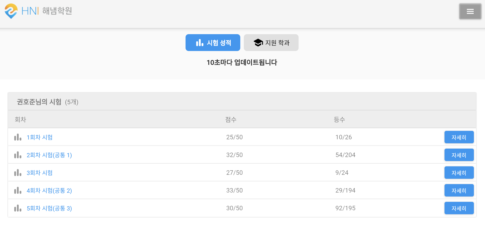
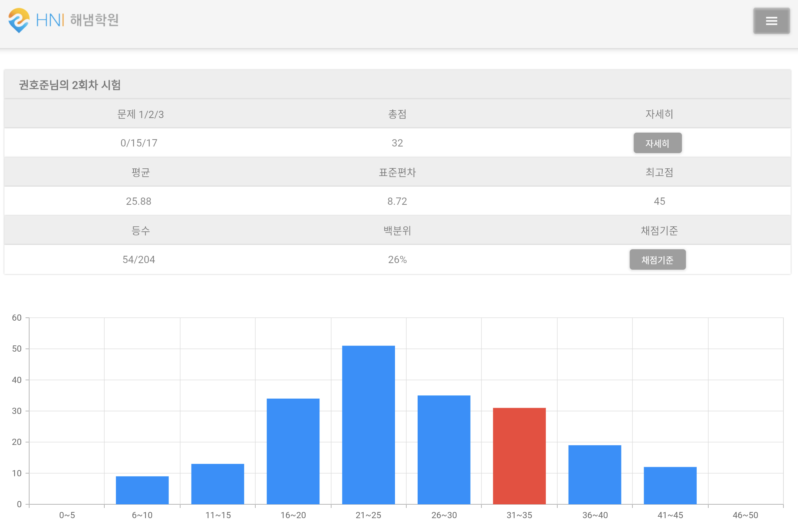
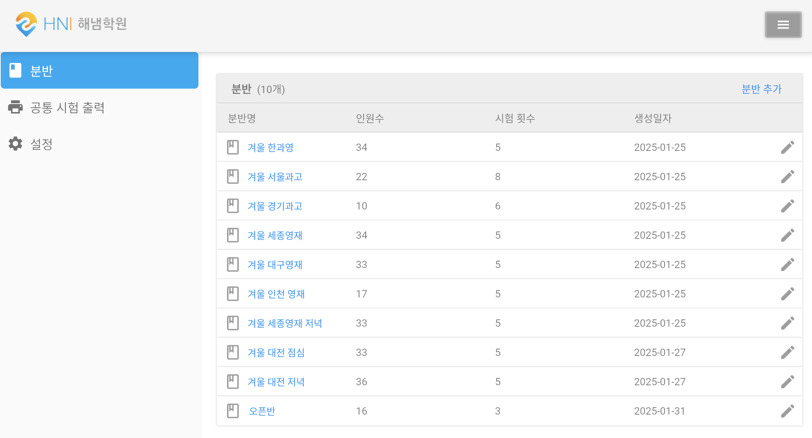
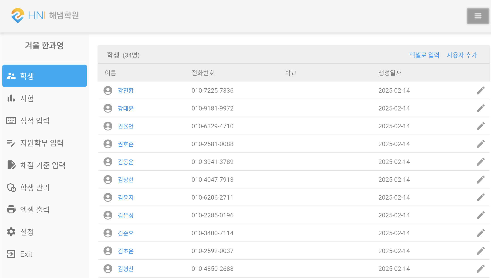
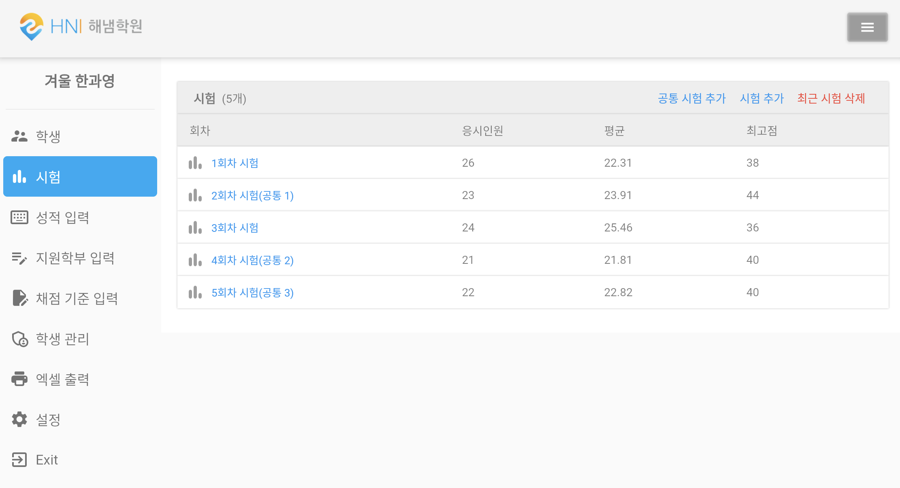

# 해냄학원 성적관리 웹사이트 V2 (2023.07. ~ )

## 📖 프로젝트 개요

---

- 해냄학원 내 엑셀로 관리되고 있는 성적들을 학부모들에게 손쉽게 보여주고자 만든 웹사이트
- 관리자들은 컴퓨터를 주로 이용하기에 컴퓨터화면에 초점을 맞췄고, 학부모들은 주로 핸드폰을 사용해서 웹사이트를 이용하기에 모바일 화면에 초점을 맞췄습니다.
- 사용자 규모: 2명의 관리자와 300명 정도의 학부모들
- 레거시 개편 이유: 다른 프로젝트를 하는 도중 Annotation을 활용한 수많은 기능, ORM 등 MVC 프레임워크의 강력한 기능들을 마주하였고, 기존 프로젝트의 레거시 개편의 필요성을 인지함.
    

## 🔨 사용 기술

---

- 백엔드: NestJS, Prisma, GraphQL
- 테스트: Jest
- DB : MySQL, Redis
- AWS: AWS RDS, AWS EC2
- 배포: Docker, GitHub Actions, AWS ElasticBeanstalk
    

## 📃 구현기능 목록

---

- 👨‍💻관리자
  - 반 관리
    - 학교별로 반 생성 및 삭제
  - 성적 관리
    - 엑셀로 시험성적 입력
    - 엑셀로 지원학과 입력
  - 성적 조회
    - 모든 학생들의 성적 세부사항 확인 가능
  - 시험별 세부 사항 출력
    - 각각의 시험마다 응시자의 순위, 점수분포, 백분위 등 시험 세부사항이 적혀있는 엑셀파일을 출력
- 🙍‍♂️사용자
  - 로그인
  - 시험 기록 조회
    - 총점, 등수 확인 가능
    - 실행 예시
  - 세부 성적 조회
    - 문제별 득점 세부사항, 평균, 표준편차, 백분위, 학과별 등수 등 시험 세부 사항 확인 가능
    - 전체 점수 분포표, 지원학과별 점수 분포표 확인 가능

 
 

## ⚡대표 화면

---

### 사용자(학부모)

- 성적 기록 확인

  

- 성적 세부 사항 확인
  
   
   

### 관리자

- 관리하는 반 목록 화면
  

- 반에 속해 있는 학생 목록

- 시험 목록

